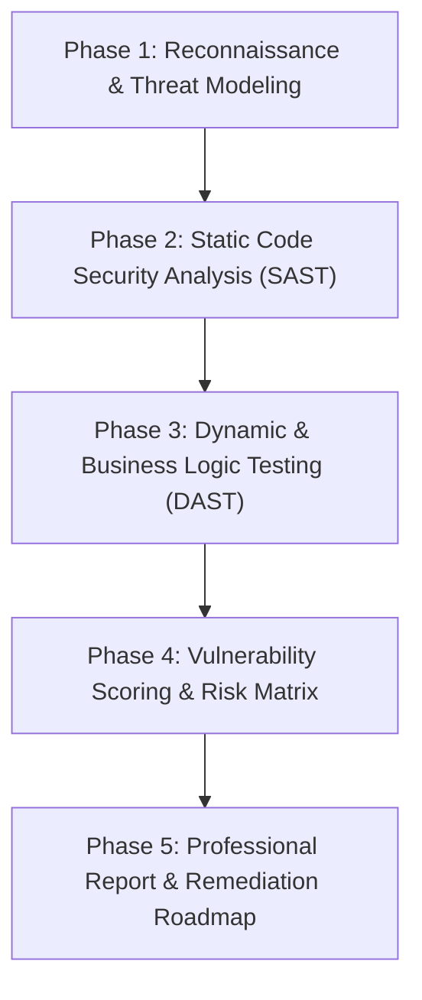

# Phased Application Security Audit and Penetration Testing Plan

This plan establishes a structured, end-to-end security analysis for the Classroom Booking System following the **OWASP Web Security Testing Guide (WSTG v4.2)** and the **Penetration Testing Execution Standard (PTES)**.

---

## Phase 1: Threat Modeling and Surface Reconnaissance

1. **Information & Surface Mapping**
   - Catalog all public and authenticated endpoints across the application (`[index.php](index.php)`, `[check.php](check.php)`, `[signupValidation.php](signupValidation.php)`, `[useraccount.php](useraccount.php)`, `[classRoomBookings.php](classRoomBookings.php)`, `[seatBookings.php](seatBookings.php)`, `[genqrcode.php](genqrcode.php)`, `[resetPassword.php](resetPassword.php)`, `[updatePassword.php](updatePassword.php)`).
   - Identify data stores and schema definitions in `[classroombooking.sql](classroombooking.sql)`.
   - Identify secret storage points in `[config/env.php](config/env.php)`, `[config/.env.example.php](config/.env.example.php)`, and database columns (`user.secret_key`, `user.password`).

2. **Threat Boundary Definition**
   - **Unauthenticated Users:** Capabilities around signup throttling, login brute force, 2FA bypass, account enumeration.
   - **Authenticated Normal Users:** Access to other users' classroom and seat bookings, tampering with parameters.
   - **Session & Infrastructure:** Cookie attributes, TLS headers, exposed database backups or config files.

---

## Phase 2: Static Application Security Testing (SAST) & Code Review

1. **Authentication & Session Lifecycle Review**
   - Inspect session initialization and cookie security in `[config/bootstrap.php](config/bootstrap.php)` (e.g., `SameSite`, `HttpOnly`, `Secure` flags, session fixation handling with `session_regenerate_id()`).
   - Audit TOTP 2FA handling in `[check.php](check.php)` and `[genqrcode.php](genqrcode.php)` for replay windows and state synchronization (`mfa_passed` session flags).
   - Review password reset workflow across `[resetPassword.php](resetPassword.php)` and `[updatePassword.php](updatePassword.php)` for unauthenticated account takeover vectors.

2. **Authorization & Access Control Checks**
   - Audit booking modification and deletion endpoints (`[DeleteSeats.php](DeleteSeats.php)`, `[DeleteClassRoom.php](DeleteClassRoom.php)`, `[insertSeatBookings.php](insertSeatBookings.php)`, `[insertClassRoomBooking.php](insertClassRoomBooking.php)`) for Insecure Direct Object Reference (IDOR) and role validation.
   - Ensure every state-changing route validates both `$_SESSION['user_id']` and `$_SESSION['mfa_passed']`.

3. **Injection and Input Validation Analysis**
   - Audit all SQL queries across data fetching scripts (`[getTableData.php](getTableData.php)`, `[getSeatsTableData.php](getSeatsTableData.php)`) to ensure strict parameterized binding (`$stmt->bind_param(...)`).
   - Analyze Cross-Site Scripting (XSS) in frontend rendering scripts (`[assets/js/index.js](assets/js/index.js)`, `[assets/js/seatBookings.js](assets/js/seatBookings.js)`) and PHP view rendering.

4. **Rate Limiting and Anti-Automation Analysis**
   - Evaluate rate limiting strategies in `[config/rate_limit.php](config/rate_limit.php)`: determine if session-only limits can be circumvented via cookie clearing, and evaluate IP-based rate limiting coverage on sensitive actions.

5. **Dependency and Supply Chain Audit**
   - Check third-party packages in `[composer.json](composer.json)` (`pragmarx/google2fa`, `paragonie/constant_time_encoding`, `sonata-project/google-authenticator`) using `composer audit`.

---

## Phase 3: Dynamic Application Security Testing (DAST) & Manual Exploitation

1. **Proxy & Interception Setup**
   - Configure OWASP ZAP or Burp Suite to intercept traffic between browser and PHP backend.
   - Set up dual-account testing (User A vs. User B) to test multi-tenant authorization boundaries.

2. **Targeted Dynamic Test Cases**
   - **Test Case D-01: 2FA Bypass:** Attempt direct invocation of `[useraccount.php](useraccount.php)` or API endpoints after step 1 login without completing `[check.php](check.php)`.
   - **Test Case D-02: IDOR on Booking Actions:** Capture deletion payloads in `[DeleteSeats.php](DeleteSeats.php)` and test deletion of reservations belonging to other user IDs.
   - **Test Case D-03: Rate Limit Bypass:** Validate if clearing `PHPSESSID` resets rate-limiting counters on brute-force attempts in `[check.php](check.php)`.
   - **Test Case D-04: CSRF Validation:** Test request forgery by stripping or spoofing the `X-CSRF-Token` header and `csrf_token` POST field on state-changing endpoints.
   - **Test Case D-05: Information Disclosure:** Test access to sensitive static assets, SQL dumps (`[classroombooking.sql](classroombooking.sql)`), and environment templates.

---

## Phase 4: Vulnerability Scoring & Risk Matrix

1. **Standardized Severity Calculation**
   - For every confirmed issue, calculate CVSS v3.1 vector string and score (Base Metric: Attack Vector, Attack Complexity, Privileges Required, User Interaction, Scope, Confidentiality, Integrity, Availability).
   - Assign standard CWE identifiers (e.g., CWE-284 Improper Access Control, CWE-798 Hard-coded Credentials, CWE-307 Excessive Authentication Attempts).

2. **Categorization Matrix**
   - Group findings by risk level (Critical, High, Medium, Low, Informational) and business impact (student data leakage, unauthorized schedule disruption, credential compromise).

---

## Phase 5: Documentation & Remediation Deliverables

1. **Executive Summary**
   - High-level overview for stakeholders detailing security posture, strengths, critical risk areas, and overall risk rating.

2. **Detailed Finding Write-ups**
   - Structure each vulnerability write-up with:
     - Finding Title, Reference ID (SEC-01, SEC-02), and Severity / CVSS score.
     - Vulnerability Classification (CWE / OWASP category).
     - Affected Components and line references.
     - Detailed Description & Business Impact.
     - Step-by-Step Proof of Concept (PoC) with HTTP request/response examples.
     - Specific Code Remediation Recommendations.

3. **Remediation Roadmap**
   - Prioritized timeline (Immediate / 0-7 days, Medium-Term / 30 days, Long-Term / 60 days) to resolve all discovered issues.
